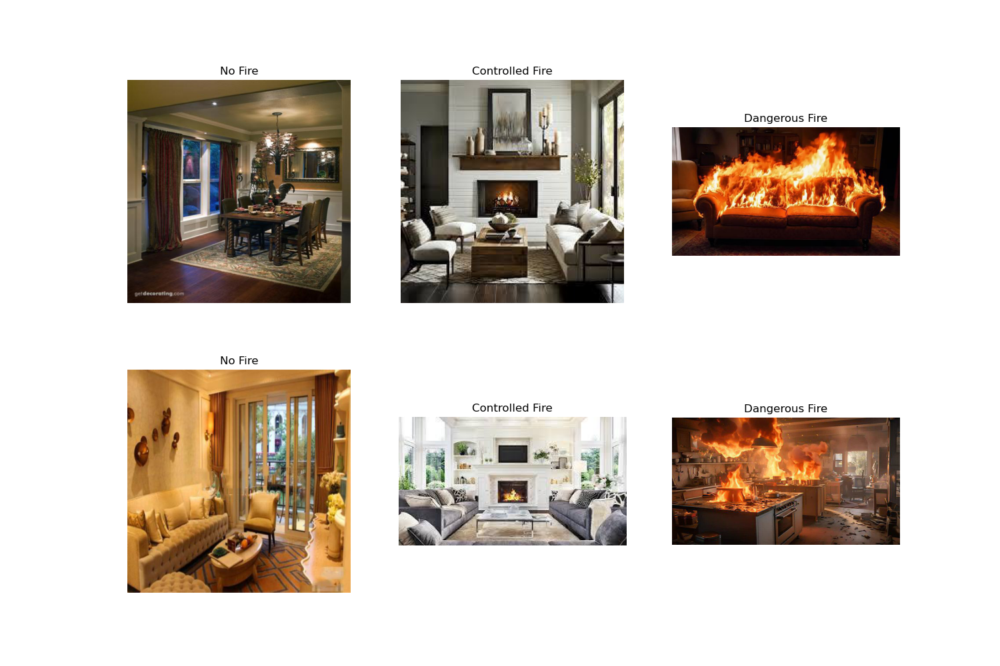
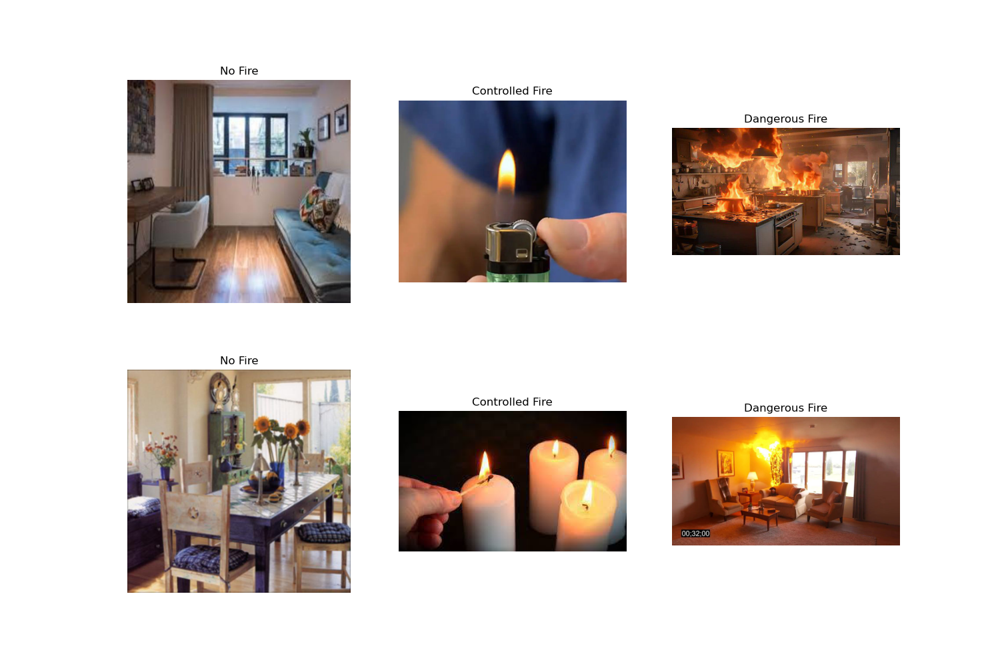

# ContextFire-VLM

A research project focused on surveying and training Visual Language Models (VLMs) to understand fire and its contextual environment. The project aims to classify images into three categories: no fire, dangerous fire, and controlled fire.

## Directory Structure

```
.
├── FIRENET.csv
├── SYN_FIRE.csv
├── frozen.csv
├── labels_v2.csv
├── main.py
├── new_labels.csv
├── requirements.txt
├── sample1.png
├── sample2.png
├── data_preprocessing_notebooks/
├── dataset_v2/
├── fine_tune_dataset/
├── model_survey_notebooks/
├── new_images/
├── scripts/
└── vlm_finetune/
```

## Dataset: CONFIRE

The CONFIRE dataset is integral to this project, categorizing images into 'no fire', 'dangerous fire', and 'controlled fire'.

### Labels Format

The `labels_v2.csv` file (and similar label files) contains the following columns:

- `image_path`: Relative path to the image file.
- `label`: Classification label (e.g., `no fire`, `dangerous fire`, `controlled fire`).
- `caption`: A detailed description of the image scene, providing contextual information for VLM training.

**Example:**

```csv
image_path,label,caption
original_dataset/image1.jpg,no fire,"The image shows a cozy living room with a fireplace, a potted plant, a lamp, and a painting on the wall. The room appears to be well-lit and decorated."
original_dataset/image37.jpg,controlled fire,"The image shows a cozy dining room with a lit fireplace, wooden chairs around a table set for a meal, and a chandelier hanging from the ceiling. The room has a warm ambiance with candles and decorative elements."
original_dataset/image1025.jpg,dangerous fire,"The image shows a kitchen with flames coming from the oven and microwave, indicating a dangerous fire situation."
```

Below are sample images from the dataset demonstrating the different classifications:





### Dataset Sources & Credits

This project integrates and utilizes datasets from the following sources, strictly for educational, research, and non-commercial purposes:

1.  **IDFire: Image Dataset for Indoor Fire Load Recognition**
    *   **Source:** [IEEE DataPort](https://ieee-dataport.org/documents/idfire-image-dataset-indoor-fire-load-recognition)
    *   **Authors:** Sheraz Ahmed, Andreas Dengel et al.
    *   **License:** [DataPort Terms of Use](https://ieee-dataport.org/terms-of-use)
    *   **Description:** A curated dataset containing indoor fire and no-fire scenarios for fire load recognition.

2.  **Home Fire Dataset**
    *   **Source:** [GitHub - PengBo0/Home-fire-dataset](https://github.com/PengBo0/Home-fire-dataset)
    *   **Author:** Pengbo Liu
    *   **License:** MIT License (as stated on the repository)
    *   **Description:** A dataset of home environments containing fire and no-fire images used for fire classification and detection tasks.

3.  **DFireDataset**
    *   **Source:** [GitHub - gaiasd/DFireDataset](https://github.com/gaiasd/DFireDataset)
    *   **Author:** Gaia Scagnetto
    *   **License:** Creative Commons Attribution 4.0 International (CC BY 4.0)
    *   **Description:** Dataset designed for detecting fires in complex scenes including blurred, nighttime, and outdoor images.

4.  **Fire Detection from Images**
    *   **Source:** [GitHub - robmarkcole/fire-detection-from-images](https://github.com/robmarkcole/fire-detection-from-images)
    *   **Author:** Rob Mark Cole
    *   **License:** MIT License
    *   **Description:** A lightweight fire dataset used in early CNN-based fire detection research, with cropped fire/non-fire examples.

## Project Structure and Contents

### Notebooks

*   **`data_preprocessing_notebooks/`**: Contains Jupyter notebooks for data preparation, including format conversion, image augmentation, automated labeling, data cleaning, and exploratory data analysis (EDA).
*   **`model_survey_notebooks/`**: Houses notebooks for benchmarking and zero-shot evaluation of various Visual Language Models (VLMs), such as Gemma 3, SmolVLM, InternVL, and different Qwen-VL variants.
*   **`vlm_finetune/`**: Includes implementations of fine-tuning pipelines for InternVL3 and Qwen2.5-VL, along with performance evaluation and training visualization.

### Data and Scripts

*   **`fine_tune_dataset/`**: Contains structured images and labels, organized into training, validation, and test splits for model training.
*   **`dataset_v2/`** and **`new_images/`**: Directories for raw and processed image assets used throughout the project.
*   **`scripts/`**: Holds utility scripts, including those for unified model evaluation across different backends.

### Core Files

*   **`main.py`**: The primary script for loading and merging fine-tuned model weights.
*   **`requirements.txt`**: Lists all project dependencies.
*   **`.csv` files**: Various label files such as `FIRENET.csv`, `SYN_FIRE.csv`, and `labels_v2.csv`, which are critical for model training and evaluation.
